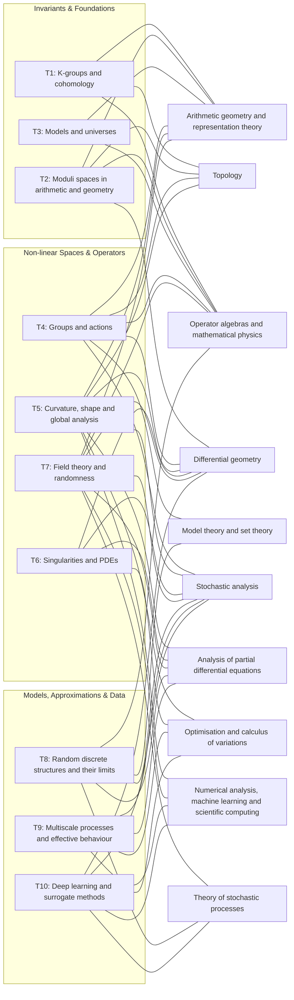

# Topics to Mathematical Fields

Relation of excellence cluster topics to mathematical fields.
Source: [Mathematics Münster Research Programme](https://www.uni-muenster.de/MathematicsMuenster/research/programme/index.shtml)

| Mathematical Field | T1 | T2 | T3 | T4 | T5 | T6 | T7 | T8 | T9 | T10 |
|---|:---:|:---:|:---:|:---:|:---:|:---:|:---:|:---:|:---:|:---:|
| Arithmetic geometry and representation theory | ✓ | ✓ | ✓ | ✓ | ✓ | | ✓ | | | |
| Model theory and set theory | | | | ✓ | | | | ✓ | | |
| Topology | ✓ | ✓ | | ✓ | ✓ | | | | | |
| Operator algebras and mathematical physics | ✓ | ✓ | ✓ | ✓ | | | ✓ | ✓ | | |
| Differential geometry | | ✓ | | ✓ | ✓ | ✓ | ✓ | | | ✓ |
| Analysis of partial differential equations | | | | | ✓ | ✓ | ✓ | ✓ | ✓ | |
| Stochastic analysis | | | | ✓ | ✓ | ✓ | ✓ | ✓ | ✓ | ✓ |
| Theory of stochastic processes | | | | | | | ✓ | ✓ | | ✓ |
| Optimisation and calculus of variations | | | | | ✓ | ✓ | | | ✓ | ✓ |
| Numerical analysis, machine learning and scientific computing | | | | | ✓ | | ✓ | | ✓ | ✓ |

**Topics:**
- T1: K-groups and cohomology
- T2: Moduli spaces in arithmetic and geometry
- T3: Models and universes
- T4: Groups and actions
- T5: Curvature, shape and global analysis
- T6: Singularities and partial differential equations
- T7: Field theory and randomness
- T8: Random discrete structures and their limits
- T9: Multiscale processes and effective behaviour
- T10: Deep learning and surrogate methods

## Graph

