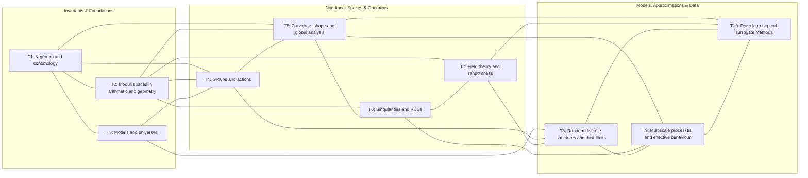

# Topics to Topics (Collaborations)

Relation of excellence cluster topics to each other via stated collaborations.
Source: [Mathematics Münster Research Programme](https://www.uni-muenster.de/MathematicsMuenster/research/programme/index.shtml)

| | T1 | T2 | T3 | T4 | T5 | T6 | T7 | T8 | T9 | T10 |
|---|:---:|:---:|:---:|:---:|:---:|:---:|:---:|:---:|:---:|:---:|
| **T1** K-groups and cohomology | — | ✓ | ✓ | ✓ | ✓ | | | | | |
| **T2** Moduli spaces in arithmetic and geometry | ✓ | — | | ✓ | ✓ | ✓ | ✓ | | | |
| **T3** Models and universes | ✓ | | — | ✓ | | | | ✓ | | |
| **T4** Groups and actions | ✓ | ✓ | ✓ | — | ✓ | | | ✓ | | |
| **T5** Curvature, shape and global analysis | ✓ | ✓ | | ✓ | — | ✓ | | | ✓ | ✓ |
| **T6** Singularities and partial differential equations | | ✓ | | | ✓ | — | ✓ | | ✓ | |
| **T7** Field theory and randomness | | ✓ | | | | ✓ | — | ✓ | | ✓ |
| **T8** Random discrete structures and their limits | | | ✓ | ✓ | | | ✓ | — | ✓ | ✓ |
| **T9** Multiscale processes and effective behaviour | | | | | ✓ | ✓ | | ✓ | — | ✓ |
| **T10** Deep learning and surrogate methods | | | | | ✓ | | ✓ | ✓ | ✓ | — |

Each ✓ indicates that at least one of the two topics lists the other as a collaboration partner on its subpage.

## Graph

